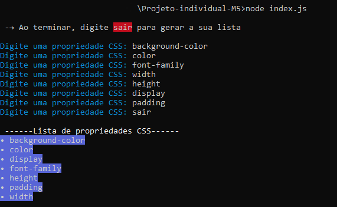

<h1 align="center">Projeto individual Resilia - Módulo 5 (Facilitando o dia a dia)</h1>

 ## 💻 Sobre o projeto
Seguindo as aulas do curso, fui capaz de desenvolver um script para o nodeJS que utiliza alguns pacotes. O script foi criado para rodar em um laço e receber propriedades CSS para retornar uma lista em ordem alfabética assim que for digitado 'sair'.



## 🤔 Como executar?

#### 1. Com o seu terminal aberto, navegue até o diretório onde deseja que o repositório seja clonado e utilize o seguinte comando:
```sh
$ git clone [link]
```

#### 2. Crie o package.json
```sh
$ npm init -y
```

#### 3. Instale as dependências
```sh
$ npm install chalk readline-sync
```

Logo após os passos anteriores, execute no terminal o comando **"node index.js"**.


